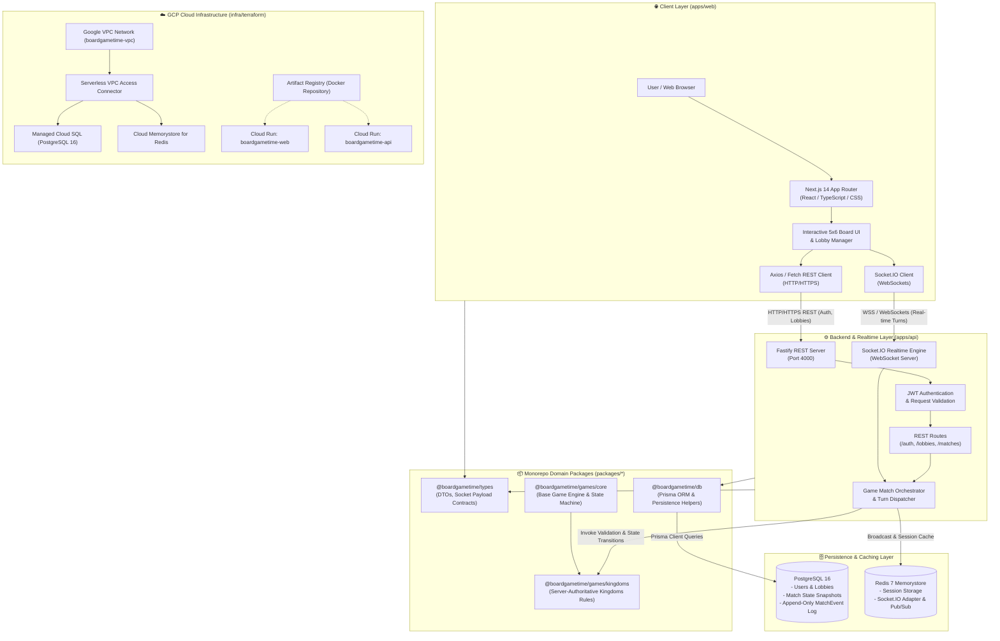
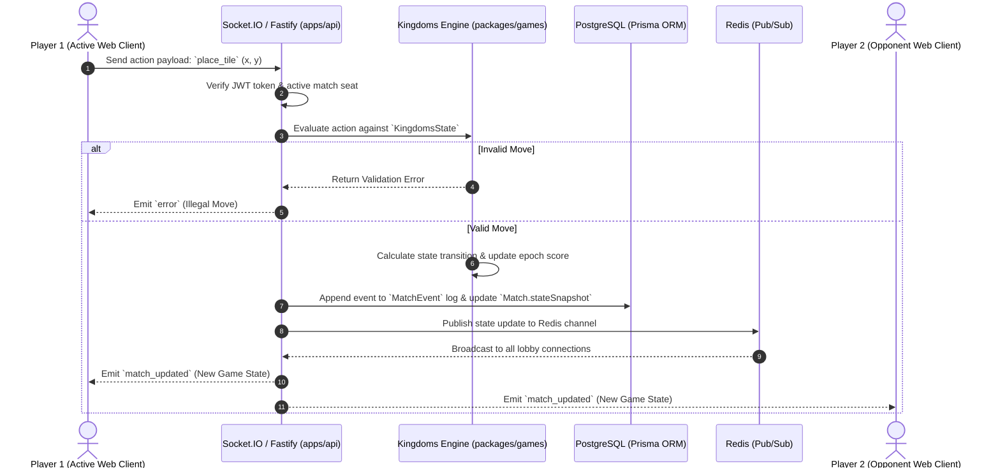

# BoardGameTime — Full-Stack Architecture Artifact

This document details the architectural layout, component interactions, data flows, and infrastructure layout for the **BoardGameTime** multiplayer board game platform.

---

## 🏗️ 1. Full-Stack System Architecture

---

## 🔄 2. Real-Time Turn Execution Data Flow

---

## 🧩 3. Component Details & Subsystem Responsibilities

| Subsystem / Layer | Monorepo Path | Technologies | Core Responsibilities |
|---|---|---|---|
| **Web Frontend** | `apps/web` | Next.js 14 (App Router), React, Tailwind CSS | Sleek dark-mode glassmorphism UI, interactive 5x6 board grid, client-side Socket.IO hooks, REST communication. |
| **API & Realtime Server** | `apps/api` | Fastify, Socket.IO Server, JWT | REST endpoints for auth/lobby control, Socket.IO gateway for real-time player actions, session validation. |
| **Rules Engine Core** | `packages/games/core` | Pure TypeScript | Base engine abstractions, state machine interfaces (`GameEngine`, `BasePlayerState`). |
| **Kingdoms Engine** | `packages/games/kingdoms` | Pure TypeScript, Vitest | Server-authoritative rules, tile placement, castle positioning, epoch scoring calculator. |
| **Database & Persistence** | `packages/db` | Prisma ORM, PostgreSQL 16 | User accounts, lobby states, match snapshots, append-only `MatchEvent` audit/replay log. |
| **Shared Contracts & Types** | `packages/types` | TypeScript DTOs | Shared API payloads, Socket event schemas, match state shapes. |
| **Cloud Infrastructure** | `infra/terraform` | GCP, HashiCorp Terraform | Managed GCP deployment via Cloud Run v2, Serverless VPC Access Connector, Cloud SQL, Cloud Memorystore Redis. |

---

## 🔒 4. Security & Network Isolation

1. **VPC Network Isolation**: Cloud SQL PostgreSQL and Cloud Memorystore Redis are deployed with private IP addresses inside the `boardgametime-vpc` Virtual Private Cloud.
2. **Serverless VPC Access**: Cloud Run services access database and Redis instances exclusively through the `boardgametime-vpc-conn` Serverless VPC Connector (`10.8.0.0/28`).
3. **Stateless Authentication**: HTTP and Socket.IO connection handshakes require signed JSON Web Tokens (JWT).
4. **Server Authoritative Architecture**: Game engine logic is executed exclusively on the server (`apps/api`); the client software only sends requested player move intent.
