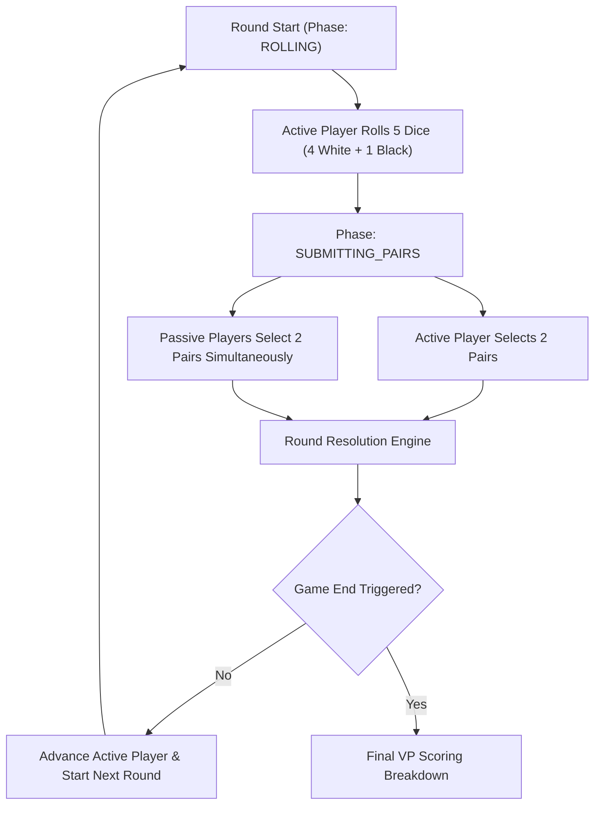

# PRD-003: Dungeons, Dice & Danger Game Engine & Interface Specifications

- **Document ID**: PRD-003
- **Status**: Approved / Active
- **Target Release**: MVP v1.1
- **Parent Platform PRD**: [PRD-001 Platform Specifications](file:///home/mike/github/boardgametime/docs/requirements/PRD-001-platform.md)
- **Source Game**: *Dungeons, Dice & Danger* (Ravensburger 2022 by Richard Garfield)
- **Rules Alignment**: Official Rulebook + Unofficial Errata v1.0

---

## 1. Game Overview & Core System

*Dungeons, Dice & Danger* is a roll-and-write dungeon crawler game for 1 to 4 players designed by Richard Garfield. Players use rolled dice combinations to navigate dungeon maps, open treasure chests, unlock special abilities, and defeat monsters to score Victory Points (VP).

### 1.1 Player Count & Game Modes
- **Player Count**: 1 to 4 players.
- **Solo Mode (1 Player)**: Full single-player mode supported with solo damage tracking and skull death game end rules.
- **Multiplayer Mode (2 to 4 Players)**: Competitive play with simultaneous pair submission phases per round.
- **Play Modes**: Real-Time (60s turn window) and Asynchronous (24h turn window).

### 1.2 Adventure Maps (All 4 Official Maps Included)
1. **Annoyed Animals** (Novice / Default): Entry level map featuring Angry Boar, Grumpy Bear, and Elder Dragon boss.
2. **Clumsy Cultists** (Easy): Featuring Clumsy Cultist, Shadow Initiate, and High Priest boss.
3. **Puzzled Pyramid** (Intermediate): Featuring Mummy Guard, Scarab Swarm, and Sphinx Pharaoh boss.
4. **Defiant Dinosaurs** (Expert): Featuring Armored Dinosaurs (Armored Raptor and T-Rex boss) requiring double-pair damage.

---

## 2. Round Lifecycle & Mechanics

### 2.1 Dice Pairing Rules
- Each round, the **Active Player** rolls 5 dice: 4 White Dice and 1 Black Die.
- Players form **2 pairs** out of the available dice:
  - **Active Player**: Can freely use the Black Die as part of their 2 pairs.
  - **Passive Players**: Form pairs using only the 4 White Dice, unless spending 1 **Black Die charge** to include the Black Die.

### 2.2 Space Marking Rules (Errata v1.0 Alignment)
- **Start Spaces (Green)**: Players can visit/mark any green Start space at any time.
- **Regular Spaces**: Must match the target sum of the dice pair and be directly adjacent to an already visited space.
- **Gray Activation Spaces**: Must be visited to unlock outlined monster life boxes.
- **Treasure Chest Spaces**: Provide immediate rewards upon being visited:
  - `BLACK_DICE`: +3 Black Die charges.
  - `TORCH`: +1 Torch (allows visiting any adjacent space without matching sum or dealing 1 monster damage).
  - `EXTRA_HEALTH`: +3 Health points and +1 Gem.

### 2.3 Monster Combat & Armored Dinosaur Rules
- **Attacking**: Roll the matching sum on an adjacent space or monster box.
- **Activation Requirement**: Outlined monster boxes require visiting their gray activation space first.
- **Armored Dinosaurs (Defiant Dinosaurs Map)**: To deal damage to an Armored Dinosaur, a player must use **both dice pairs in the same turn** targeting the monster (dealing 2 damage at once or 0).
- **Defeat Rewards**: First player to defeat a monster gains full gem rewards and incurs the monster's life penalty.

### 2.4 Solo Play Damage Rules
- In Solo mode, the player must deal at least 1 damage to a monster during each round. If no damage is dealt to a monster during a round, the solo player loses 1 Health point.
- The solo player may forfeit the 2nd dice pair without taking a forfeiture penalty as long as damage was dealt to a monster.
- Solo game ends when all monsters are defeated or when the player's health track reaches 0 (skulls crossed off).

---

## 3. Victory Point (VP) Scoring Engine

Final scoring calculates Victory Points based on:
1. **Gems**: 3 VP per Gem collected.
2. **Gold**: 2 VP per Gold collected.
3. **Defeated Monsters**: Full gem VP value for monsters defeated first.
4. **Boss Monster Damage (Errata v1.0)**: Players who dealt damage to the Boss Monster without finishing it earn **1 gem (3 VPs) per 3 damage dealt** at game end.
5. **Health Penalties**: Each skull crossed off on the player's health track subtracts 1 VP.

---

## 4. Interface & React Components (`apps/web`)

### 4.1 Component Architecture
- `DungeonSheet.tsx`: Renders the selected map grid (Start, Regular, Gray Activation, Chests, Monster rooms, and visited paths).
- `DicePairSelector.tsx`: 3D-styled dice visualizer (4 White + 1 Black die) with pair sum calculation, Black die charge toggle, and pair forfeit controls.
- `PlayerTrackerCard.tsx`: Real-time player status card tracking 10 HP health bar, skulls crossed, torches, black die charges, gems, and total VP score.
- `DungeonsDiceDangerMatchView.tsx`: Complete match page view incorporating active roller turn controls, simultaneous passive submission notifications, and final game completion scoring modal.
- `CreateLobbyModal.tsx`: Room creation modal supporting 1-4 players game configuration and map selection.

---

## 5. Automated Verification & Testing

- **Engine Test Suite (`src/__tests__/engine.test.ts`)**: Tests solo play initialization, active roll execution, pair validation, black die charge deduction, and forfeit penalties.
- **Maps Test Suite (`src/__tests__/maps.test.ts`)**: Validates cell graph structures and monster definitions for all 4 maps.
- **Scoring Test Suite (`src/__tests__/scoring.test.ts`)**: Tests VP calculations, gem/gold multipliers, boss damage partial scoring, and skull penalties.
